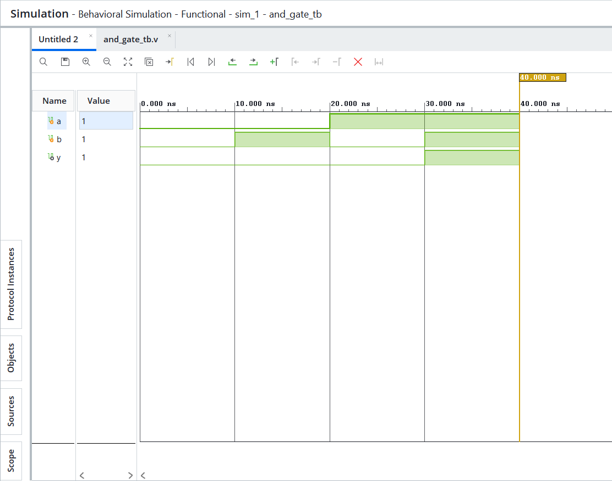
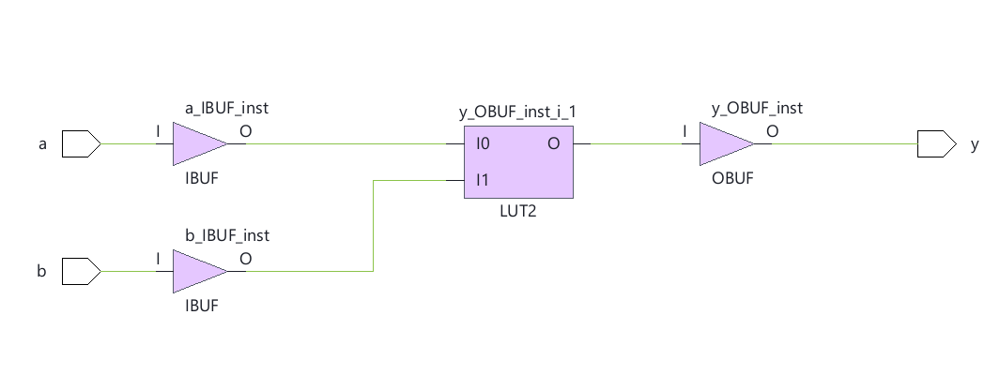
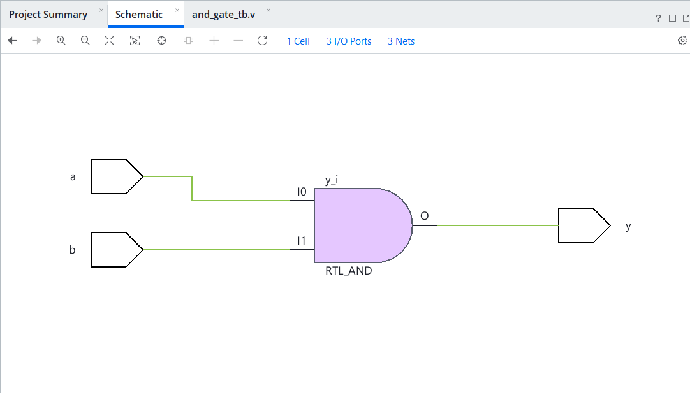

# 🔹 01 — AND Gate

## 📌 Overview

A basic 2-input AND gate designed using Verilog HDL and taken through the complete RTL design flow using Vivado.

## 🎯 Objective

To design, simulate, synthesize, and implement a basic 2-input AND gate using Verilog.

---

## 💻 1. RTL Design

### Verilog Code

[View `and_gate.v`](RTL/and_gate.v)

The RTL describes a 2-input AND gate with inputs `A` and `B` and output `Y`.

---

## 🧪 2. Testbench

### Testbench Code

[View `AND_gate_tb.v`](Testbench/AND_gate_tb.v)

The testbench applies all possible combinations of inputs:

| A | B | Expected Y |
| - | - | ---------- |
| 0 | 0 | 0          |
| 0 | 1 | 0          |
| 1 | 0 | 0          |
| 1 | 1 | 1          |

---

## 📊 3. Simulation

### Waveform



The waveform confirms that the output follows the expected AND-gate truth table.

---

## ⚙️ 4. Synthesis

### Synthesized Design



The RTL was successfully synthesized in Vivado.

---

## 🔧 5. Implementation

### Implemented Design



The design was successfully implemented.

---

## 🛠️ Tools Used

* Verilog HDL
* AMD Vivado
* RTL Simulation
* Synthesis
* Implementation

---

## 📁 Project Structure

```text
01_AND Gate/
├── readme.md
├── RTL/
│   └── and_gate.v
├── Testbench/
│   └── AND_gate_tb.v
├── Simulation/
│   └── Simulation.png
├── Schematic/
│   └── Schematic.png
└── Synthesis/
    └── Synthesis.png
```
