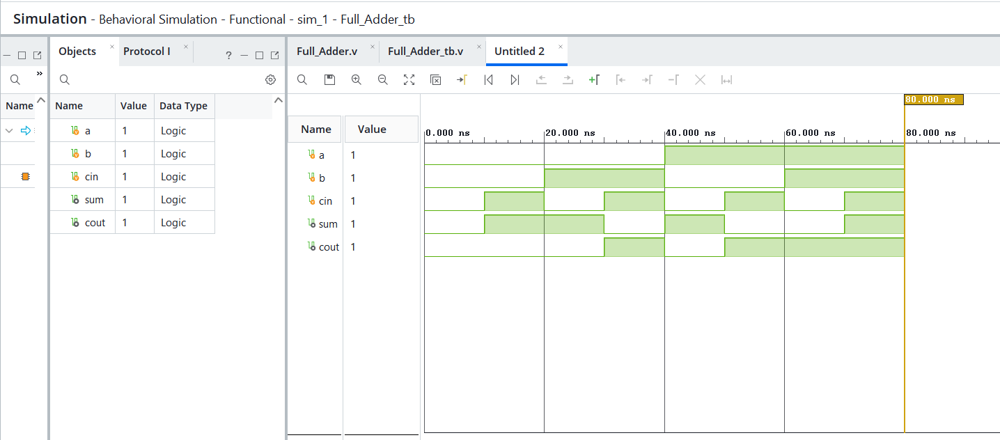
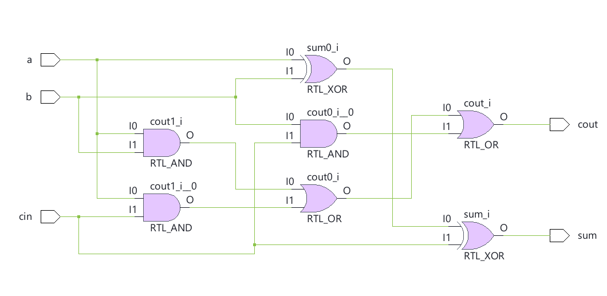

# 🔹 04 — Full Adder

## 📌 Overview

A Full Adder designed using Verilog HDL to perform the addition of three single-bit binary inputs.

## 🎯 Objective

To design and simulate a Full Adder using Verilog HDL and verify its functionality through RTL simulation and schematic generation.

A Full Adder adds two binary inputs along with a carry input and produces two outputs:

* **Sum** — Result of the binary addition
* **Carry** — Carry generated from the addition

---

## 💻 1. RTL Design

### Verilog Code

[View RTL Source →](RTL/Full_Adder.v)

The RTL design uses three 1-bit inputs (`A`, `B`, and `Cin`) and produces `Sum` and `Cout` outputs.

### Logic

```text id="tx8wqq"
Sum  = A ⊕ B ⊕ Cin

Cout = (A · B) + (A · Cin) + (B · Cin)
```

### Truth Table

| A | B | Cin | Sum | Cout |
| - | - | --- | --- | ---- |
| 0 | 0 | 0   | 0   | 0    |
| 0 | 0 | 1   | 1   | 0    |
| 0 | 1 | 0   | 1   | 0    |
| 0 | 1 | 1   | 0   | 1    |
| 1 | 0 | 0   | 1   | 0    |
| 1 | 0 | 1   | 0   | 1    |
| 1 | 1 | 0   | 0   | 1    |
| 1 | 1 | 1   | 1   | 1    |

---

## 🧪 2. Testbench

### Testbench Code

[View Testbench →](Testbench/Full_Adder_tb.v)

The testbench applies all possible combinations of the three inputs and verifies the resulting `Sum` and `Cout` outputs.

---

## 📊 3. Simulation

### Waveform



The simulation waveform confirms that the Full Adder produces the expected Sum and Carry outputs for all input combinations.

[View Simulation File →](Simulation/Simulation.png)

---

## 🔗 4. RTL Schematic

### Schematic



The generated schematic represents the hardware structure described by the Verilog RTL.

[View Schematic →](Schematic/Schematic.png)

---

## 🛠️ Tools Used

* Verilog HDL
* AMD Vivado
* RTL Simulation
* RTL Schematic

---

## 📁 Project Structure

```text id="yq3b2d"
04_Full_Adder/
├── readme.md
├── RTL/
│   └── Full_Adder.v
├── Testbench/
│   └── Full_Adder_tb.v
├── Simulation/
│   └── Simulation.png
└── Schematic/
    └── Schematic.png
```
