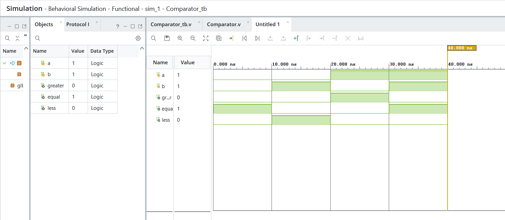
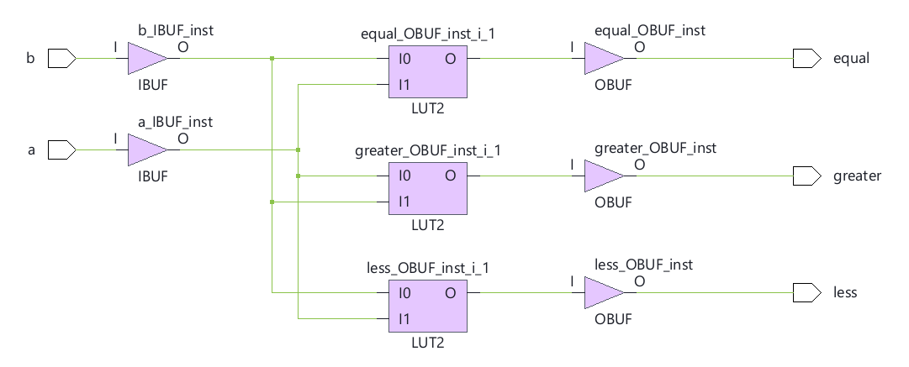

# 🔹 05 — Comparator

## 📌 Overview

A digital comparator designed using Verilog HDL to compare two binary inputs and determine their relative magnitude.

## 🎯 Objective

To design and simulate a digital comparator using Verilog HDL and verify its functionality through RTL simulation and schematic generation.

The comparator determines whether one input is:

* **Greater than** the other
* **Equal to** the other
* **Less than** the other

---

## 💻 1. RTL Design

### Verilog Code

[View RTL Source →](RTL/Comparator.v)

The RTL design compares two input signals and produces outputs indicating the relationship between them.

### Logic

```text id="9wn5nq"
A > B  →  Greater
A = B  →  Equal
A < B  →  Less
```

---

## 🧪 2. Testbench

### Testbench Code

[View Testbench →](Testbench/Comparator_tb.v)

The testbench applies different combinations of input values and verifies the comparator outputs for each case.

---

## 📊 3. Simulation

### Waveform



The simulation waveform confirms that the comparator correctly identifies the relationship between the two input values.

[View Simulation File →](Simulation/Simulation.png)

---

## 🔗 4. RTL Schematic

### Schematic



The generated RTL schematic represents the hardware structure described by the Verilog design.

[View Schematic →](Schematic/Schematic.png)

---

## 🛠️ Tools Used

* Verilog HDL
* AMD Vivado
* RTL Simulation
* RTL Schematic

---

## 📁 Project Structure

```text id="j4d8xq"
05_Comparator/
├── readme.md
├── RTL/
│   └── Comparator.v
├── Testbench/
│   └── Comparator_tb.v
├── Simulation/
│   └── Simulation.png
└── Schematic/
    └── Schematic.png
```
