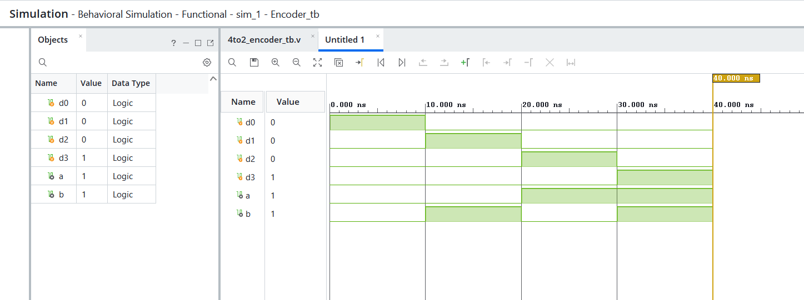
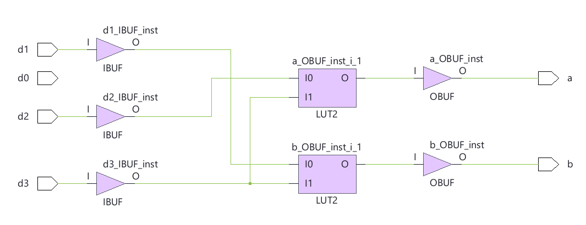

# 🔹 07 — 4:2 Encoder

## 📌 Overview

A 4:2 Encoder designed using Verilog HDL to convert one of four active input signals into a corresponding 2-bit binary output.

## 🎯 Objective

To design and simulate a 4:2 Encoder using Verilog HDL and verify its functionality through RTL simulation and schematic generation.

The encoder converts the active input line into its corresponding binary representation.

---

## 💻 1. RTL Design

### Verilog Code

[View RTL Source →](RTL/4to2_Encoder.v)

The RTL design accepts four input signals (`I0`, `I1`, `I2`, `I3`) and produces a 2-bit encoded output.

### Truth Table

| I3 | I2 | I1 | I0 | Y1 | Y0 |
| -- | -- | -- | -- | -- | -- |
| 0  | 0  | 0  | 1  | 0  | 0  |
| 0  | 0  | 1  | 0  | 0  | 1  |
| 0  | 1  | 0  | 0  | 1  | 0  |
| 1  | 0  | 0  | 0  | 1  | 1  |

> **Note:** This basic encoder assumes that only one input is active at a time.

---

## 🧪 2. Testbench

### Testbench Code

[View Testbench →](Testbench/4to2_encoder_tb.v)

The testbench activates each input individually and verifies that the encoder produces the corresponding 2-bit binary output.

---

## 📊 3. Simulation

### Waveform



The simulation waveform confirms that each active input is correctly converted into its corresponding binary output.

[View Simulation File →](Simulation/Simulation.png)

---

## 🔗 4. RTL Schematic

### Schematic



The generated RTL schematic represents the hardware structure described by the Verilog design.

[View Schematic →](Schematic/Schematic.png)

---

## 🛠️ Tools Used

* Verilog HDL
* AMD Vivado
* RTL Simulation
* RTL Schematic

---

## 📁 Project Structure

```text
07_4to2_Encoder/
├── readme.md
├── RTL/
│   └── 4to2_Encoder.v
├── Testbench/
│   └── 4to2_encoder_tb.v
├── Simulation/
│   └── Simulation.png
└── Schematic/
    └── Schematic.png
```
