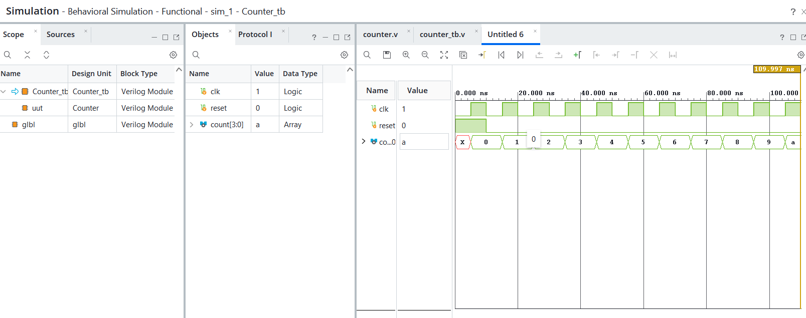
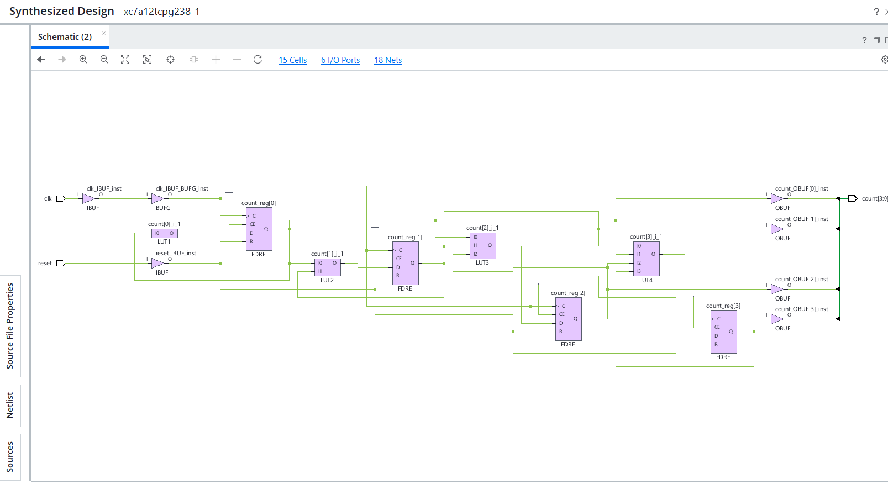

# 🔹 09 — Counter

## 📌 Overview

A digital counter designed using Verilog HDL to demonstrate sequential state progression based on a clock signal.

## 🎯 Objective

To design and simulate a counter using Verilog HDL and verify its sequential behavior through RTL simulation and schematic generation.

The counter increments its stored value on each active clock edge.

---

## 💻 1. RTL Design

### Verilog Code

[View RTL Source →](RTL/Counter.v)

The RTL design uses a clock signal to update the counter value sequentially.

### Operation

```text id="k4m2pt"
At every active clock edge:

Counter ← Counter + 1
```

The counter retains its current value between clock edges.

---

## 🧪 2. Testbench

### Testbench Code

[View Testbench →](Testbench/counter_tb.v)

The testbench generates the clock signal and observes the counter output over multiple clock cycles to verify the counting sequence.

---

## 📊 3. Simulation

### Waveform



The simulation waveform demonstrates the counter incrementing its value sequentially with each active clock edge.

[View Simulation File →](Simulation/Simulation.png)

---

## 🔗 4. RTL Schematic

### Schematic



The generated RTL schematic represents the sequential hardware structure described by the Verilog design.

[View Schematic →](Schematic/Schematic.png)

---

## 🛠️ Tools Used

* Verilog HDL
* AMD Vivado
* RTL Simulation
* RTL Schematic

---

## 📁 Project Structure

```text id="r8j3vn"
09_Counter/
├── readme.md
├── RTL/
│   └── Counter.v
├── Testbench/
│   └── counter_tb.v
├── Simulation/
│   └── Simulation.png
└── Schematic/
    └── Schematic.png
```
